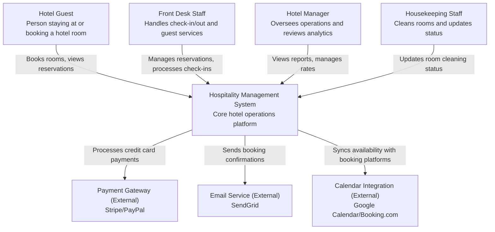
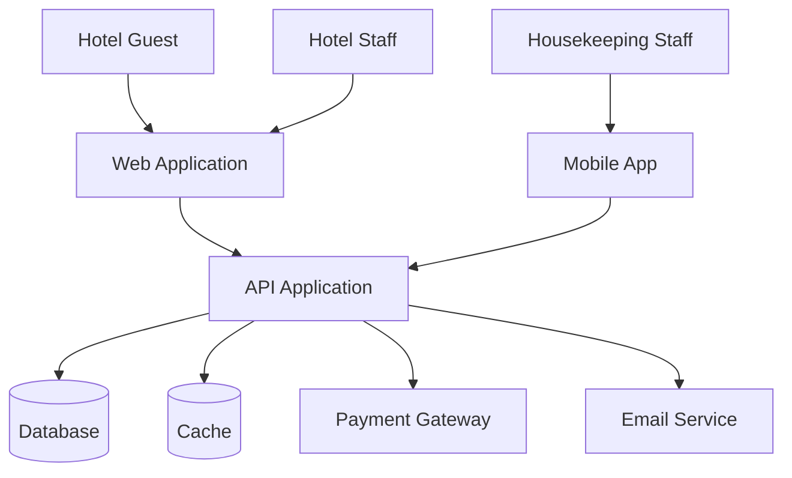
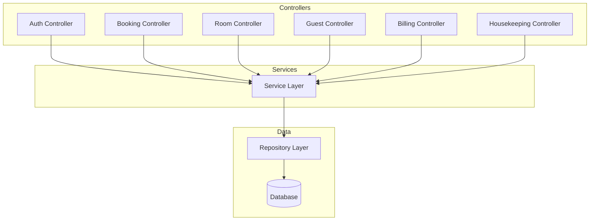
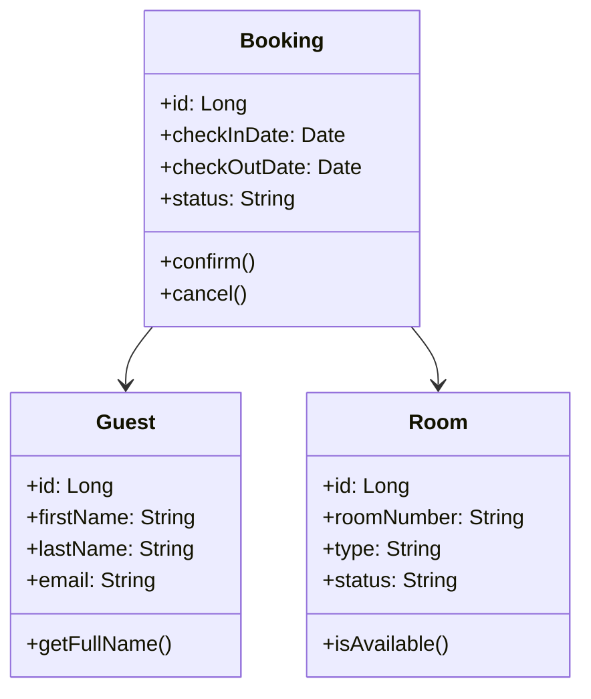
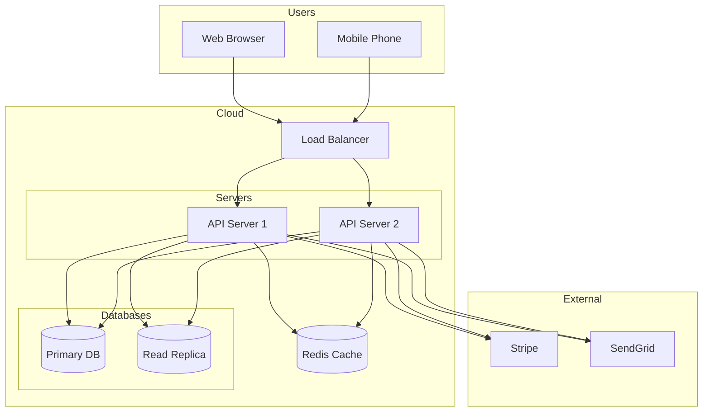
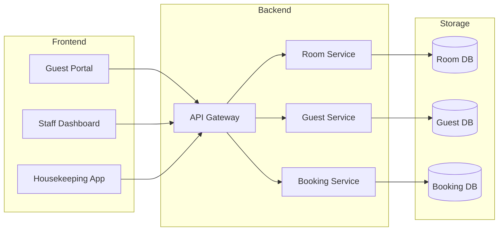
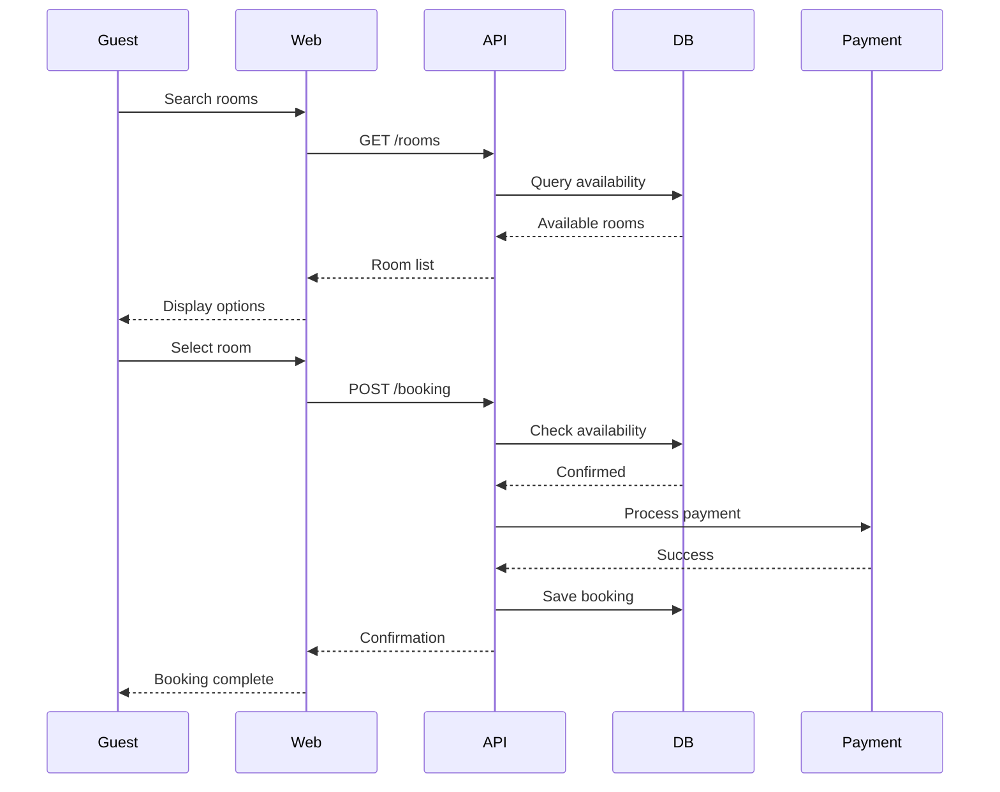
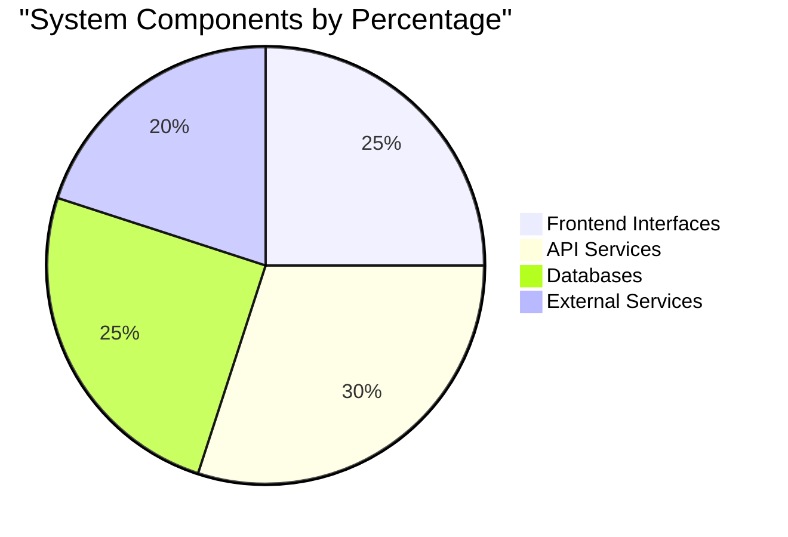

# C4 Architectural Diagrams: Hospitality Management System

## Project Title
Hospitality Management System

## Domain
Hospitality/Hotel Operations

## Problem Statement
Small to medium-sized hotels need an integrated digital platform to manage room inventory, reservations, guest check-in/out, and housekeeping coordination to eliminate manual processes, reduce errors, and improve operational efficiency.

## Individual Scope
The system focuses on core hotel operations (front desk, reservations, room management) and is designed for incremental development, starting with essential features and expanding to additional modules as time permits.

---

## Context Diagram (Level 1)
*Shows the system boundaries and external users/services*

## CONTAINER DIAGRAM (LEVEL 2)

## COMPONENT DIAGRAM (LEVEL 3)

## CODE DIAGRAM (LEVEL 4)

## DEPLOYMENT DIAGRAM

## SYSTEM FLOW DIAGRAM

## BOOKING SEQUENCE DIAGRAM

## COMPONENT DISTRIBUTION CHART

