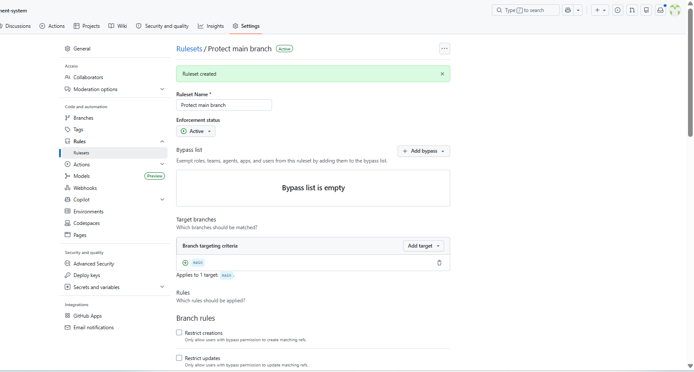

# Branch Protection Rules - HotelHub

## Overview

Branch protection rules are critical for maintaining code quality and preventing errors from reaching production. This document explains the rules configured for the `main` branch.

## Ruleset Configuration

| Setting | Value |
|---------|-------|
| **Ruleset Name** | Protect main branch |
| **Enforcement Status** | Active |
| **Target Branch** | main |

## Protection Rules Applied

| Rule | Setting | Why It Matters |
|------|---------|----------------|
| **Require pull request before merging** | Enabled | Ensures all changes are reviewed before reaching main branch |
| **Required approvals** | 1 approval | At least one person must review and approve the code |
| **Require status checks to pass** | Run Tests | CI pipeline must pass before merge is allowed |
| **Require branches to be up to date** | Enabled | PR must be tested with latest main branch code |
| **Block force pushes** | Enabled | Prevents rewriting commit history on main |

## How CI/CD Works with Protection

1. Developer creates a branch and opens a Pull Request to `main`
2. GitHub Actions automatically runs all tests (Run Tests job)
3. If tests PASS → PR can be merged (after review)
4. If tests FAIL → Merge button is disabled
5. After merge to `main`, the Build job runs and creates a release artifact

## Benefits

| Benefit | Description |
|---------|-------------|
| **Quality Control** | No broken code reaches main branch |
| **Team Collaboration** | PR reviews improve code quality |
| **Audit Trail** | All changes are documented and reviewed |
| **Automated Testing** | No manual test steps to remember |
| **Release Artifacts** | Automatic packaging for deployment |

## Screenshot

## Related Files

- [CI/CD Workflow](.github/workflows/ci.yml)
- [README.md](README.md)
