# Use Case Diagram - Hospitality Management System

```mermaid
graph TB
    subgraph Actors["ACTORS"]
        direction LR
        Guest["Hotel Guest"]
        FrontDesk["Front Desk Staff"]
        Housekeeping["Housekeeping Staff"]
        Manager["Hotel Manager"]
        ITAdmin["IT Administrator"]
        Finance["Finance Department"]
        Marketing["Marketing Team"]
        RestaurantMgr["Restaurant Manager"]
    end

    subgraph SystemBoundary["HOTELHUB SYSTEM BOUNDARY"]
        
        subgraph BookingMgmt["BOOKING MANAGEMENT"]
            UC1["Search Rooms"]
            UC2["Book Room"]
            UC3["Cancel Booking"]
            UC4["View Booking History"]
        end
        
        subgraph GuestServices["GUEST SERVICES"]
            UC5["Online Check-in"]
            UC6["Online Check-out"]
            UC7["Request Service"]
            UC8["Make Payment"]
            UC17["Manage Guest Profile"]
        end
        
        subgraph Operations["OPERATIONS"]
            UC9["Manage Housekeeping Tasks"]
            UC10["Process Walk-in Check-in"]
            UC11["Manage Maintenance Requests"]
            UC12["Generate Reports"]
        end
        
        subgraph AdminMgmt["ADMINISTRATION"]
            UC13["Manage Staff Accounts"]
            UC14["View Dashboard"]
            UC15["Manage OTA Integration"]
            UC16["Create Promotions"]
            UC18["Manage Notifications"]
        end
    end

    Guest --> UC1
    Guest --> UC2
    Guest --> UC3
    Guest --> UC4
    Guest --> UC5
    Guest --> UC6
    Guest --> UC7
    Guest --> UC8
    Guest --> UC17
    
    FrontDesk --> UC7
    FrontDesk --> UC8
    FrontDesk --> UC9
    FrontDesk --> UC10
    FrontDesk --> UC14
    FrontDesk --> UC17
    
    Housekeeping --> UC9
    Housekeeping --> UC11
    
    Manager --> UC12
    Manager --> UC14
    Manager --> UC16
    
    ITAdmin --> UC13
    ITAdmin --> UC14
    ITAdmin --> UC18
    
    Finance --> UC8
    Finance --> UC12
    
    Marketing --> UC15
    Marketing --> UC16
    
    RestaurantMgr --> UC7
    
    UC2 -.->|include| UC1
    UC5 -.->|include| UC8
    UC6 -.->|include| UC8
    
    UC7 -.->|extend| UC11
    UC2 -.->|extend| UC18
    UC5 -.->|extend| UC18
    UC7 -.->|extend| UC18
```

## Written Explanation of Use Case Diagram

### 1. Key Actors and Their Roles

The diagram includes 8 actors, each representing a stakeholder identified in Assignment 4:

| Actor | Role Description |
|-------|------------------|
| **Hotel Guest** | Primary user who interacts with the system to search for rooms, make bookings, cancel reservations, view booking history, perform online check-in/out, request services, make payments, and manage their profile |
| **Front Desk Staff** | Operational staff who handle walk-in check-ins, manage housekeeping tasks, assist with service requests, process payments, view operational dashboards, and manage guest profiles |
| **Housekeeping Staff** | Staff responsible for managing housekeeping tasks and reporting maintenance issues through the mobile interface |
| **Hotel Manager** | Management role that generates operational and financial reports, views performance dashboards, and creates promotional campaigns |
| **IT Administrator** | Technical role that manages staff accounts, views system dashboards, and configures notification settings |
| **Finance Department** | Financial role that processes payments and generates financial reports for auditing and reconciliation |
| **Marketing Team** | Promotional role that manages Online Travel Agency (OTA) integrations and creates marketing promotions to increase direct bookings |
| **Restaurant Manager** | Ancillary service role that monitors and manages room service requests to ensure timely delivery |

### 2. Relationships Between Actors and Use Cases

**Include Relationships:**

| From Use Case | To Use Case | Explanation |
|---------------|-------------|-------------|
| **Book Room** | **Search Rooms** | The booking process cannot proceed without first searching for and selecting an available room |
| **Online Check-in** | **Make Payment** | Guests must complete payment before they can check in online |
| **Online Check-out** | **Make Payment** | Any outstanding balance must be settled during check-out |

**Extend Relationships:**

| From Use Case | To Use Case | Condition for Extension |
|---------------|-------------|------------------------|
| **Request Service** | **Manage Maintenance Requests** | When a guest reports a maintenance issue |
| **Book Room** | **Manage Notifications** | Every booking completion triggers confirmation notifications |
| **Online Check-in** | **Manage Notifications** | Every check-in triggers pre-arrival and welcome notifications |
| **Request Service** | **Manage Notifications** | Every service request triggers alerts to staff members |

### 3. How the Diagram Addresses Stakeholder Concerns from Assignment 4

| Stakeholder | Concern from Assignment 4 | Addressed By |
|-------------|--------------------------|--------------|
| Hotel Guest | Easy room search and booking; quick check-in/out | Search Rooms, Book Room, Online Check-in, Online Check-out, Request Service |
| Front Desk Staff | Efficient room assignment; clear room status | Manage Housekeeping Tasks, Process Walk-in Check-in, View Dashboard |
| Housekeeping Staff | Clear priority of rooms to clean | Manage Housekeeping Tasks, Manage Maintenance Requests |
| Hotel Manager | Real-time occupancy monitoring; revenue optimization | Generate Reports, View Dashboard, Create Promotions |
| IT Administrator | System uptime; data security; user management | Manage Staff Accounts, View Dashboard, Manage Notifications |
| Finance Department | Accurate payment processing; audit trails | Make Payment, Generate Reports |
| Marketing Team | OTA integration; promotional campaigns | Manage OTA Integration, Create Promotions |
| Restaurant Manager | Room service integration | Request Service |

### 4. Summary of Diagram Metrics

| Metric | Count |
|--------|-------|
| Total Actors | 8 |
| Total Use Cases | 18 |
| Include Relationships | 3 |
| Extend Relationships | 4 |
| Functional Categories | 4 |
