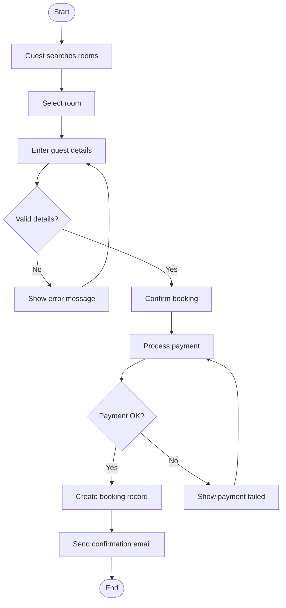

# Assignment 8: Activity Diagrams – Workflow Modeling

## Overview
This document contains 8 activity diagrams for complex workflows in the HotelHub system. Each diagram shows start/end nodes, actions, decisions, and swimlanes.

---

## 1. Book Room Activity Diagram

Explanation:
The guest starts by searching for rooms. After selecting a room, they enter their details (name, email, phone). The system validates the details – if invalid (e.g., missing name, bad email format), it shows an error and asks the guest to re-enter. Once valid, the guest confirms the booking.

Next, the system processes payment. If payment fails (e.g., declined card), it shows a failure message and returns to the payment step. If payment succeeds, the system creates a booking record and sends a confirmation email. The process ends.

Swimlanes: Guest (search, select, enter, confirm); System (validate, process, create, send email)

Traceability: FR-1, FR-7

User Stories US-001, US-002, US-003
