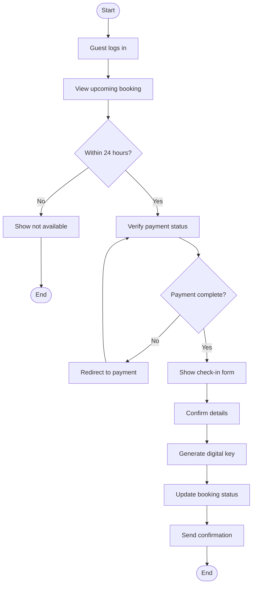
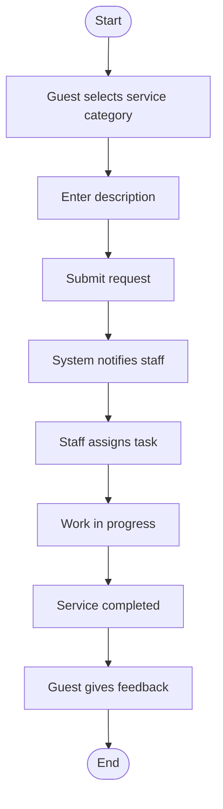
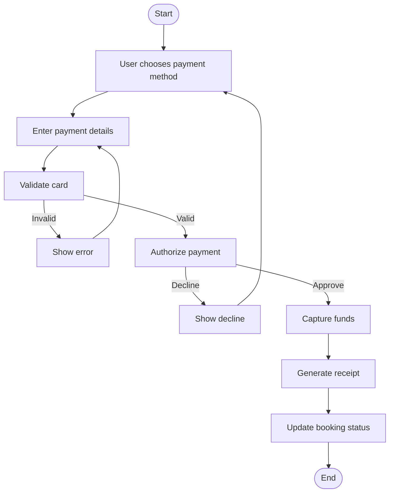
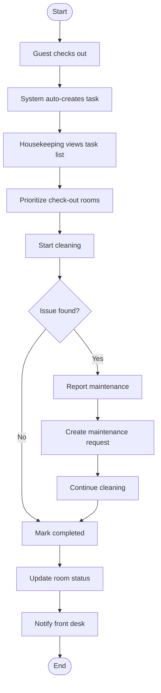

# Assignment 8: Activity Diagrams – Workflow Modeling

## Overview
This document contains 8 activity diagrams for complex workflows in the HotelHub system. Each diagram shows start/end nodes, actions, decisions, and swimlanes.

---

## 1. Book Room Activity Diagram

Explanation:
The guest starts by searching for rooms. After selecting a room, they enter their details (name, email, phone). The system validates the details – if invalid (e.g., missing name, bad email format), it shows an error and asks the guest to re-enter. Once valid, the guest confirms the booking.

Next, the system processes payment. If payment fails (e.g., declined card), it shows a failure message and returns to the payment step. If payment succeeds, the system creates a booking record and sends a confirmation email. The process ends.

Swimlanes: Guest (search, select, enter, confirm); System (validate, process, create, send email)

Traceability: FR-1, FR-7

User Stories US-001, US-002, US-003

## 2. Online Check-in Activity Diagram

Explanation:
The guest logs in and views their upcoming booking. The system checks if the check-in window is open (within 24 hours of arrival). If not, it shows a message and ends. If yes, it verifies that payment is complete. If payment is missing, the guest is redirected to pay.

Once payment is confirmed, the guest sees a check-in form to confirm details (e.g., number of guests, vehicle info). After confirmation, the system generates a digital room key (if supported), updates the booking status to "Checked In", and sends a confirmation email/notification.

Swimlanes: Guest (login, view, confirm); System (verify, generate, update, send)

Traceability: FR-2, FR-7; User Story US-004

## 3. Request Service Activity Diagram

Explanation:
The guest selects a service category (housekeeping, room service, maintenance) and enters a description. After submitting, the system notifies the relevant staff (e.g., housekeeping for towels, kitchen for food). A staff member picks up the task and assigns it to themselves. They work on it, then mark it completed. Finally, the guest provides feedback (e.g., rating, comment). This feedback helps the hotel improve service quality.

Swimlanes: Guest (select, describe, submit, feedback); System (notify); Staff (assign, work)

Traceability: FR-4; User Story US-005

## 4. Process Payment Activity Diagram

Explanation: 
The user (guest or front desk staff) chooses a payment method (credit card, debit card, digital wallet). They enter card details. The system validates the card format (e.g., 16 digits, valid expiry). If invalid, it shows an error and asks again.

Once valid, the system authorizes the payment with the gateway. If declined (e.g., insufficient funds), it shows a decline message and returns to method selection. If approved, it captures the funds, generates a receipt, and updates the booking status to "Confirmed". The process ends.

Swimlanes: User (choose, enter); System (validate, authorize, capture, generate, update)

Traceability: FR-7; User Stories US-003, US-013

## 5. Manage Housekeeping Task Activity Diagram

Explanation: 
When a guest checks out, the system automatically creates a housekeeping task for that room. Housekeeping staff view their task list and prioritize check-out rooms (since those need to be ready for new guests). They start cleaning.

If they find an issue (e.g., broken fixture, stained carpet), they report maintenance, which creates a separate maintenance request. They continue cleaning after noting the issue. If no issue, they mark the task completed. The system updates the room status to "Available" and notifies the front desk that the room is ready.

Swimlanes: Guest (checkout); System (auto-create, update, notify); Housekeeping (view, prioritize, start, report, complete); Front Desk (receive notification)

Traceability: FR-3; User Story US-006

