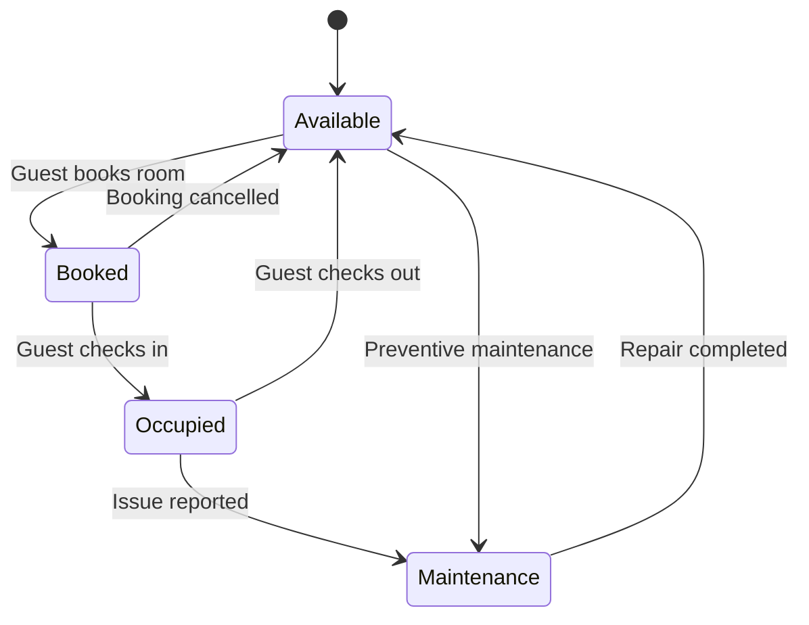

# Assignment 8: State Transition Diagrams – Object Lifecycles

## Overview
This document contains 8 state transition diagrams for critical objects in the HotelHub system. Each diagram shows the object's lifecycle, states, transitions, and triggering events.

---

## 1. Room State Diagram

Explanation:

Key states: Available, Booked, Occupied, Maintenance

Transitions: Triggered by events: book, cancel, check-in, check-out, report issue, complete repair.

FR mapping: FR-1 (Room Booking and Search) – “Booked” state ensures room is reserved. FR-2 (Online Check-in/out) – moves from Booked → Occupied → Available. FR-9 (Maintenance Request) – moves to Maintenance state.
