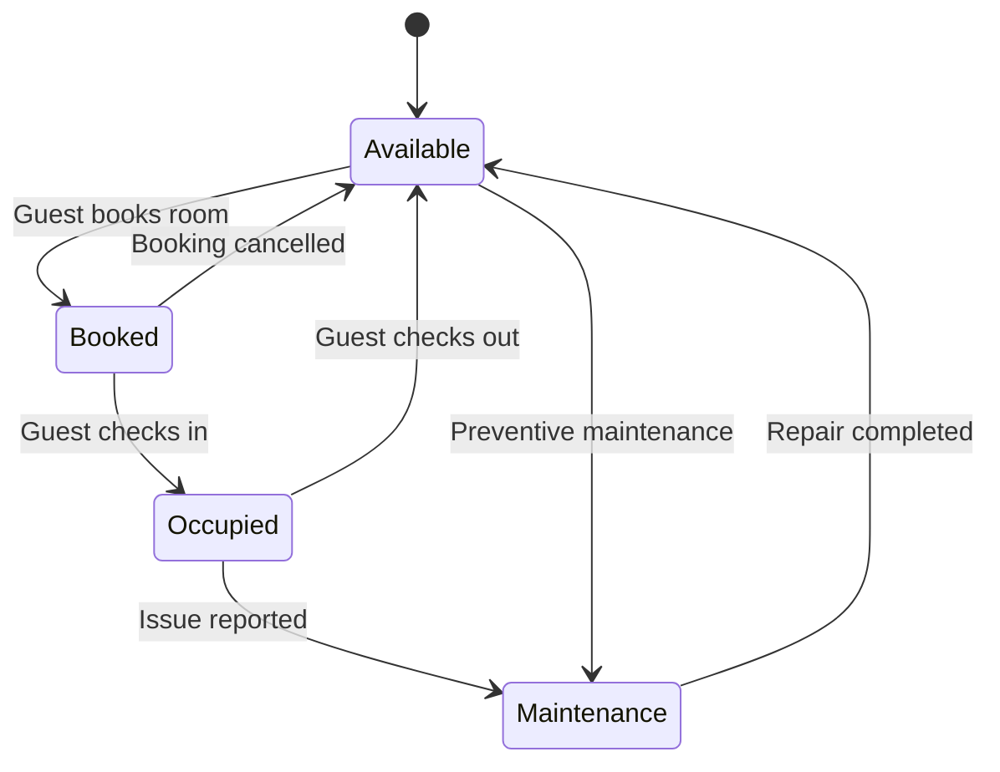

# Assignment 8: State Transition Diagrams – Object Lifecycles

## Overview
This document contains 8 state transition diagrams for critical objects in the HotelHub system. Each diagram shows the object's lifecycle, states, transitions, and triggering events.

---

## 1. Room State Diagram

Explanation:
A hotel room starts in the Available state. When a guest makes a booking, the room becomes Booked – it is reserved but not yet occupied. If the guest cancels, the room returns to Available. When the guest checks in, the room moves to Occupied. After check-out, it becomes Available again.

If a guest or housekeeper reports an issue (e.g., broken AC), the room moves to Maintenance. It stays there until repairs are completed, then returns to Available. Additionally, the hotel manager can place a room into Maintenance for preventive work (e.g., deep cleaning, painting). This ensures that unavailable rooms are not accidentally booked.
