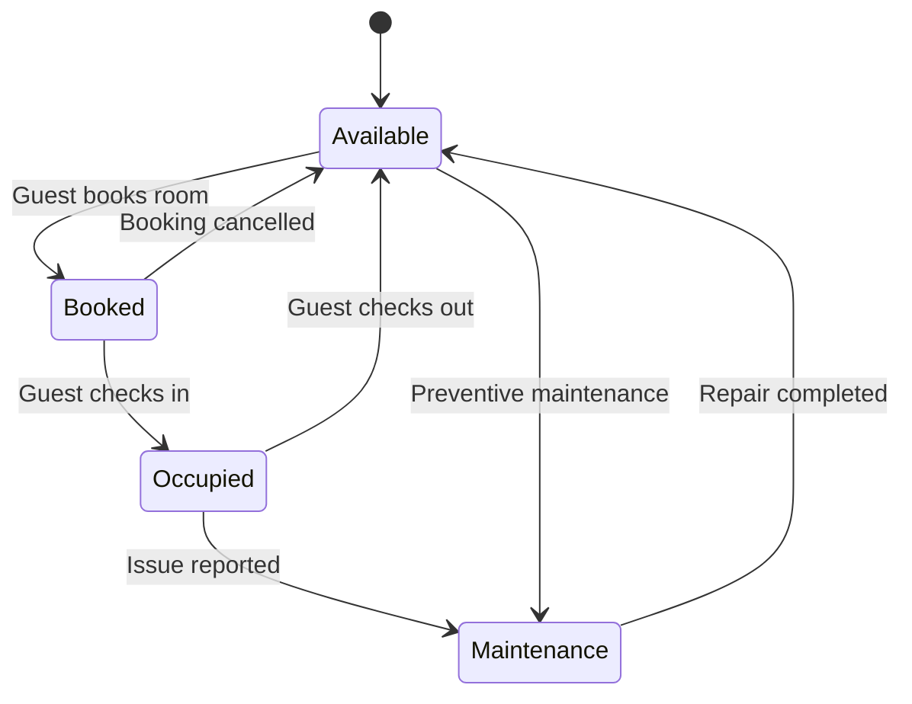
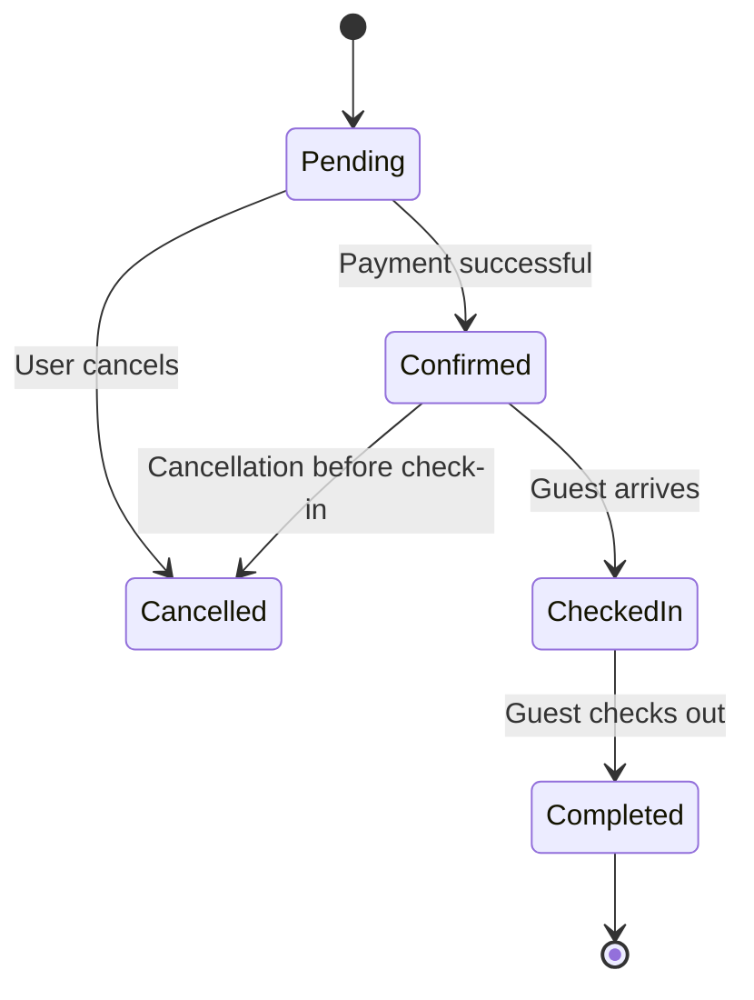
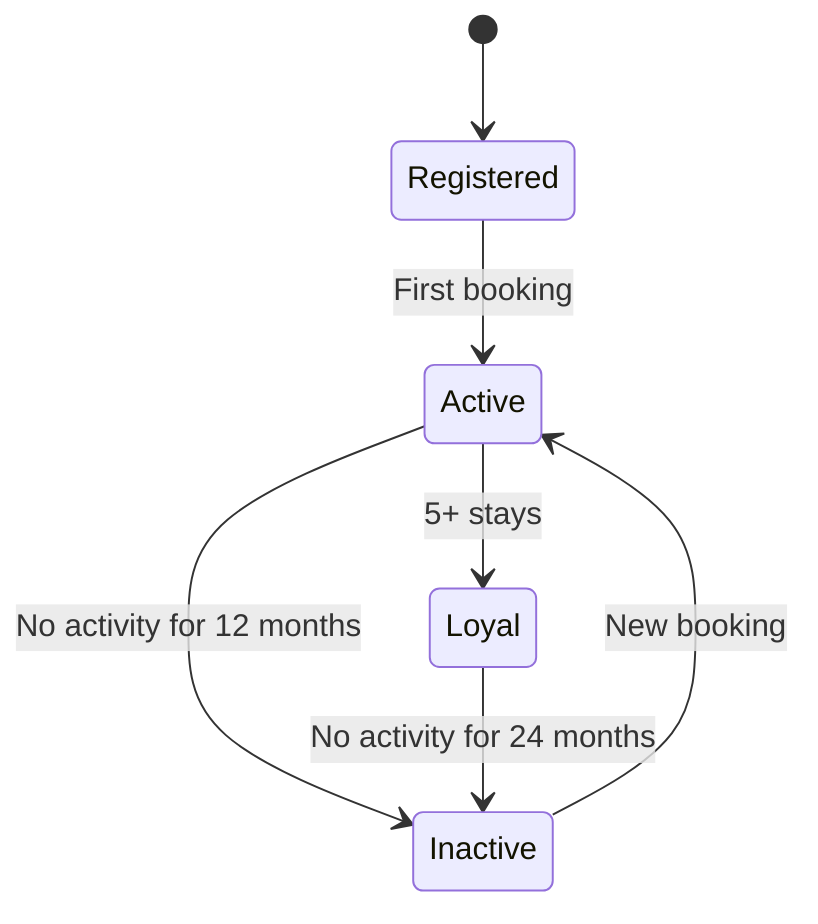
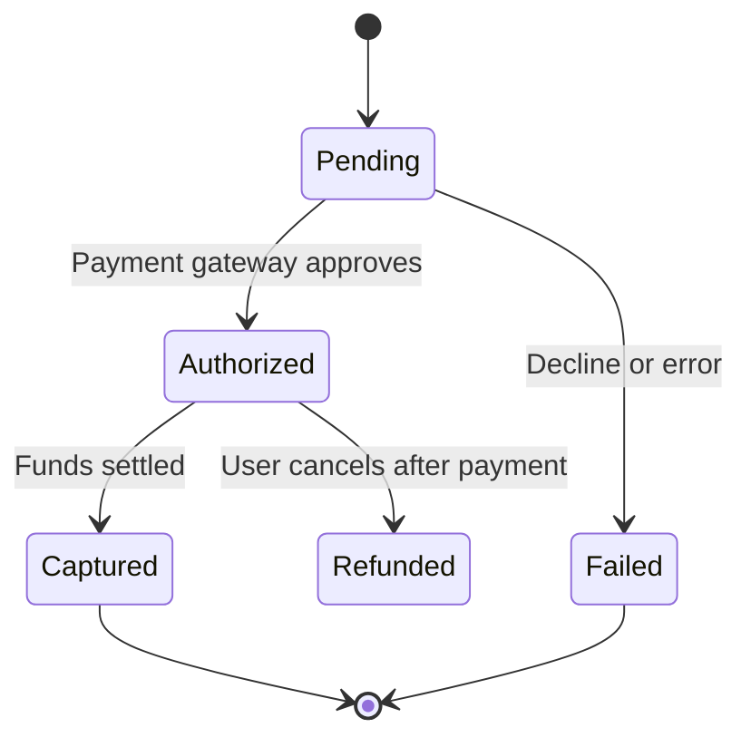
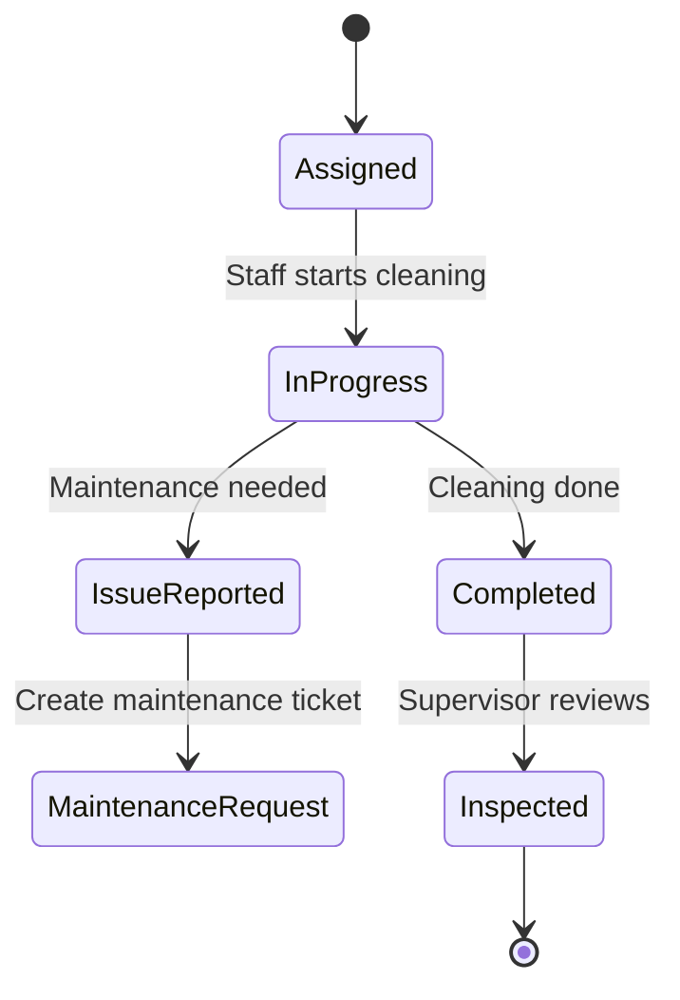

# Assignment 8: State Transition Diagrams – Object Lifecycles

## Overview
This document contains 8 state transition diagrams for critical objects in the HotelHub system. Each diagram shows the object's lifecycle, states, transitions, and triggering events.

---

## 1. Room State Diagram

Explanation:
A hotel room starts in the *Available* state. When a guest makes a booking, the room becomes *Booked*; it is reserved but not yet occupied. If the guest cancels, the room returns to *Available*. When the guest checks in, the room moves to *Occupied*. After check-out, it becomes *Available* again.

If a guest or housekeeper reports an issue (e.g., broken AC), the room moves to *Maintenance*. It stays there until repairs are completed, then returns to *Available*. Additionally, the hotel manager can place a room into *Maintenance* for preventive work (e.g., deep cleaning, painting). This ensures that unavailable rooms are not accidentally booked.

Traceability:
FR-1 (Room Booking and Search) – uses Available and Booked states

FR-2 (Online Check-in/out) – uses Booked → Occupied → Available

FR-9 (Maintenance Request) – uses Occupied → Maintenance → Available

User Stories: US-001, US-004, US-010

## 2. Booking State Diagram
   

Explanation:
When a guest creates a booking, it starts as Pending. At this stage, the room is temporarily held, but the booking is not final. If the guest completes payment successfully, the booking becomes Confirmed – the room is now locked for the guest. If the guest cancels before paying, the booking goes to Cancelled and the room is released.

Once the booking is confirmed, the guest can check in, moving the booking to CheckedIn. After the guest checks out, the booking becomes Completed and the lifecycle ends. If the guest cancels after confirmation (but before check-in), the booking also becomes Cancelled, and a refund process may be triggered (handled by the Payment object).

Traceability:

FR-1 (Room Booking) – Pending and Confirmed

FR-2 (Check-in) – Confirmed → CheckedIn

FR-7 (Payments) – Pending → Confirmed only after payment success

User Stories: US-002, US-003, US-004

## 3. Guest State Diagram

Explanation:
A guest becomes Registered when they create a profile. After they complete their first booking, they become Active – a regular guest. If they accumulate 5 or more stays, they reach Loyal status, which can unlock special promotions (e.g., free room upgrade, late check-out).

If an Active guest has no bookings for 12 months, they move to Inactive. Loyal guests have a longer grace period: 24 months of inactivity before becoming Inactive. An Inactive guest can become Active again simply by making a new booking. This lifecycle helps the Marketing Team target promotions based on guest loyalty.

Traceability:

FR-11 (Guest Profile Management) – tracks loyalty status

User Story: US-015

## 4. Payment State Diagram

Explanation:
When a guest initiates a payment, the transaction is Pending. The system sends the card details to the payment gateway. If the gateway approves the transaction (card valid, funds available), the payment moves to Authorized – the funds are reserved but not yet taken. If the gateway declines or there is an error, the payment goes to Failed and the lifecycle ends.

From Authorized, the system can either Capture the funds (move to Captured – money taken) or Refund the guest (if they cancel before the booking is finalized). Once captured, the payment is complete. This lifecycle ensures the Finance Department has a clear audit trail for every transaction.

Traceability:

FR-7 (Integrated Billing) – full payment lifecycle

User Stories: US-003, US-013

## 5. Housekeeping Task State Diagram

Explanation:
When a guest checks out, the system creates a housekeeping task in the Assigned state. A housekeeper picks up the task and starts working, moving it to InProgress. If the cleaning is completed without issues, it becomes Completed. However, if the housekeeper finds a problem (e.g., broken lamp, leaking tap), they move the task to IssueReported. This automatically creates a separate maintenance request.

After a task is Completed, a supervisor must Inspect the room to ensure quality standards. Only after inspection does the task end. This ensures that no room is marked clean without proper verification.

Traceability:

FR-3 (Housekeeping Task Management)

User Story: US-006

